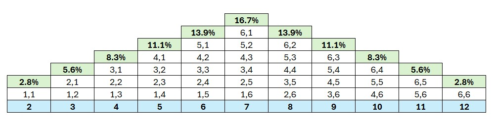

```{r setup, include=FALSE}
knitr::opts_chunk$set(echo = TRUE)
```

Monte Carlo simulation to estimate the probability of winning a simple dice game. The game involves rolling two six-sided dice, and the player wins if the sum of the dice is 7.

The possible outcomes of rolling two six-sided dice:



As we increase the number of rolls (number of simulations) our win probability = 7 should approach 17%. When the number of simulated dice rolls is low, the results of the model are quite unpredictable. However as we increase the number of rolls the probability stabilizes and approaches the expected value of 17%. If we were modeling a coin toss instead of rolling dice, we would expect the probability to approach 50% as the number of simulations grows.

```{r}
# Function to perform Monte Carlo simulation for a dice game
monte_carlo_dice_simulation <- function(rolls, simulations) {
  
  # Set seed for reproducibility
  set.seed(123)
  
  # Create matrix to store simulation results
  wins <- matrix(0, nrow = simulations, ncol = 1)
  
  # Perform Monte Carlo simulation
  for (i in 1:simulations) {
    # Simulate rolling two six-sided dice 'rolls' times
    dice_rolls <- sample(1:6, rolls, replace = TRUE) + sample(1:6, rolls, replace = TRUE)
    
    # Check if the sum is 7 for each roll
    wins[i,] <- sum(dice_rolls == 7) > 0
  }
  
  # Calculate the estimated probability of winning
  win_probability <- cumsum(wins) / seq_along(wins)
  
  return(win_probability)
}

# Set parameters for the simulation
rolls <- 1        # Number of dice rolls in each simulation
simulations <- 10000  # Number of simulations

# Run Monte Carlo simulation for the dice game
win_probability <- monte_carlo_dice_simulation(rolls, simulations)

# Plot the results
p <- plot(seq_along(win_probability), win_probability, type = "l", 
     xlab = "Number of Simulations", ylab = "Win Probability",
     main = "Monte Carlo Simulation of Dice Game",
     col = "blue", lwd = 2)
```
